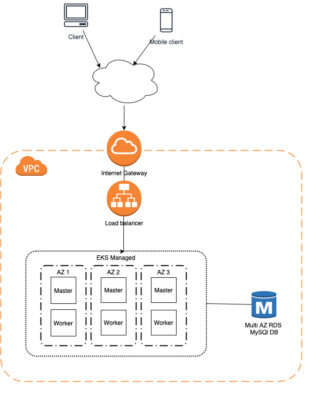

# Infra as code - EKS / TimeOff Management Application Test
Repository containing infra as code for the TimeOff Management Application (Gorilla Logic DevOps test).


## Design




*NOTE:* I am fully aware that if a single part of the architecture is not highly available then the whole setup is not highly available, but having said that for the sake of simplicity the application uses the default SQLite DB for simplicity's sake, although i mention a multi AZ DB as part of the infra design

*NOTE:* The application is running in a private subnet with no direct access from the internet to their underlying infrastructure, it can only be accessed via the Load Balancer. About the exposed protocols, only HTTP is used since i didn't have a public domain at hand for the solution i chose (EKS, etc) but it's trivial to add by using the AWS ACM service and the ALB Ingress Controller annotations.

## Enviornment Setup
In order to deploy the resources defined in this repo make sure to set the following tooling in your machine:

```
- Terragrunt >= v0.23.0
- Terraform >= v0.12.0
- Kubectl >= 1.16
- AWS CLI >= 1.17.7
```

After setting up proper credentials for the target environment, make sure to setup the K8S authentication via the AWS CLI:
```
aws eks --region us-east-1 update-kubeconfig --name default
```

## Deployment
- Set the target environment
```
source env/dev.sh
```

- Run the Terraform plans
```
cd $PROJECT_ROOT/terragrunt
terragrunt apply-all
```

- Since AWS Fargate is being used for both "regular" and system pods, a fix needs to be applied so the CoreDNS pods don't stay in pending state due to no nodes being available. To do this, the deployment definition needs to be patched and the rollout restarted:
```
kubectl patch deployment coredns -n kube-system --type json -p='[{"op": "remove", "path": "/spec/template/metadata/annotations/eks.amazonaws.com~1compute-type"}]'
kubectl rollout restart -n kube-system deployment coredns
```

- Create the necessary RBAC configuration for the ALB controller and the ALB controller itself. Before applying the manifests, modify the  VPC ID in the `k8s/alb-ingress-controller.yaml` file which necessary if using Fargate for the ALB to know where to spin up the LBs.
```
cd $PROJECT_ROOT/k8s
kubectl apply -f .
```
